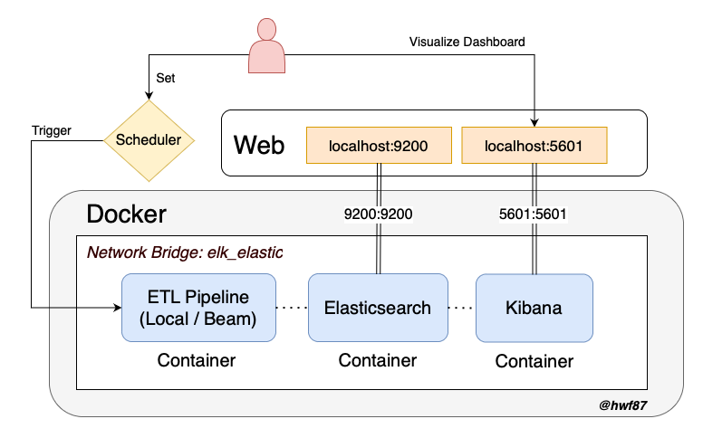
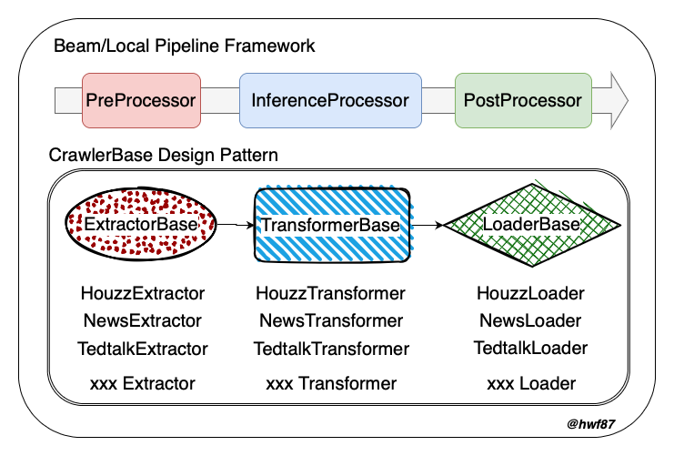

# hwf-search-etl


This is a data scraping project that sources data from the Houzz e-commerce platform, the CNN YouTube channel, and the TedTalk official website. The implementation uses the Apache Beam framework to build an ETL pipeline and write the results into an Elasticsearch database. The final step visualizes the crawler results using Kibana.

## Medium Blogs
[[Data Engineering] Build a web crawling ETL pipeline with Apache Beam + Elasticsearch + Kibana](https://jackyfu1995.medium.com)

## Architecture & Pipeline Design Overview



## How to Start
1. git clone https://github.com/hwf87/hwf-search-etl.git

2. Create a .env file with following configs
> Note that YOUTUBE_API_KEY you can easily create one for yourself from [YouTube Data API v3](https://console.cloud.google.com/apis/library/youtube.googleapis.com).

> ES HOST, USERNAME, PASSWORD can also be modified, but you'll need to do the corresponding work on docker-compose-elk.yaml 
```
YOUTUBE_API_KEY={CREATE-ONE-FOR-YOUSELF}
ES_HOST=http://es-container:9200
ES_USERNAME=elastic
ES_PASSWORD=elastic
```

3. Create a virtual environment for testing 
```
conda create -n search_engine python=3.8
conda activate search_engine
```

4. Download SentenceTransformer pretrain model from HuggingFace
> You'll be able to find sentence_embedding_model.pth file in model folder after execute following commands
```
cd ./hwf-search-etl
pip install -r requirements.txt
python ./model/download_pretrain_model.py
```

5. Build Elasticsearch & Kibana Service
> visit http://127.0.0.1:9200 for elasticsearch

> visit http://127.0.0.1:5601 for kibana

> check docker container by 'docker ps'

> check elk_elastic network exists by 'docker network ls'
```
cd ./elk 
docker-compose -f docker-compose-elk.yaml up -d
docker ps
docker network ls
```

6. Build Pipeline images
```
cd ./hwf-search-etl
docker build --tag search-etl -f Pipeline.Dockerfile .
docker images
```

7. Run Pipeline
- export RUN_MODE=local | beam
- export DATA_SOURCE=houzz | news | tedtalk
```
docker run --rm --network elk_elastic --env-file .env search-etl $RUN_MODE $DATA_SOURCE
```

## How to run without docker for Debuging
1. Set environment variaables
```
set -a
source .env
set +a
```
2. Execute Pipeline
```
conda activate search_engine
python pipeline.py $RUN_MODE $DATA_SOURCE
```

## Unit Test
```
bash unit_test.sh
```

## Precommit
- Black
- Flake8
```
```

## CI/CD
- Githun Actions
```
```